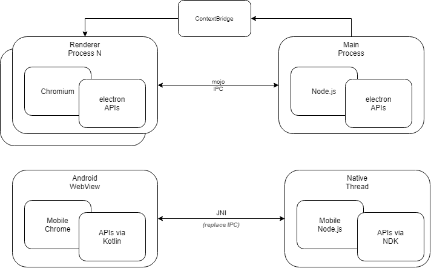

# Electrom
## Architecture

### android_app/app/src/main/assets/electron_app
- 실제 electron 앱의 자바스크립트 소스코드와 에셋파일들

### android_app/electron
- 라이브러리로 분리될 electron API 구현체

### android_app/electron/src/main/cpp
#### android_context.cpp
- `StartRendererProcess`
    - Node에서 BrowserWindow 클래스가 생성될 때 호출되는 JNI 함수
- `CommandToRendererProcess`
    - Android WebView에 명령이 필요할 때 실행되는 JNI 함수

#### electron.cpp
- `Java_com_electrom_process_MainProcess_startMainModule`
    - electron 메인 모듈 시작 함수 Node embedded 환경을 시작한다.

### android_app/electron/src/main/java
#### ElectronApp.kt
- `startMainProcess`
    - electron 자바스크립트 코드를 로드하기 위한 진입점

#### process/MainProcess.kt
- Node embedded 환경을 구성하고 NDK에서 실행되는 Java함수를 핸들링하는 클래스

#### process/RendererProcess.kt
- ElectronWebView를 관리하는 클래스

#### view/ElectronWebView.kt
- electron의 요구사항에 맞는 옵션이 설정되어 있는 WebView

## Current Goal
- Support only one renderer process
- Implement features in these projects first
    - [x] https://github.com/electron/simple-samples/tree/master/prices

## Not Goal
- webPrefernces options (e.g. Node integration)
    - but, you can use devTools option via chrome `chrome://inspect/#devices`
